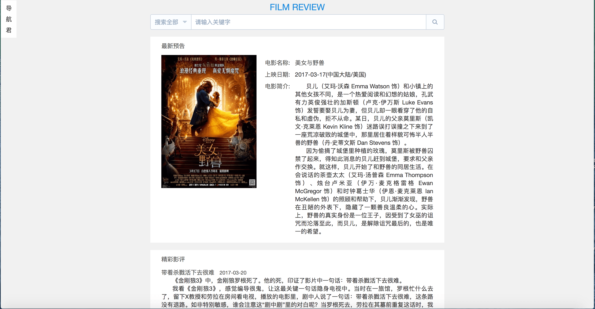
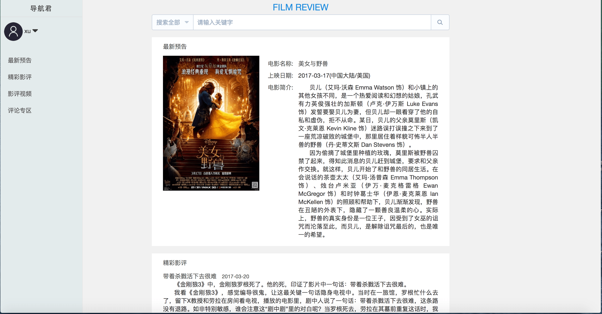
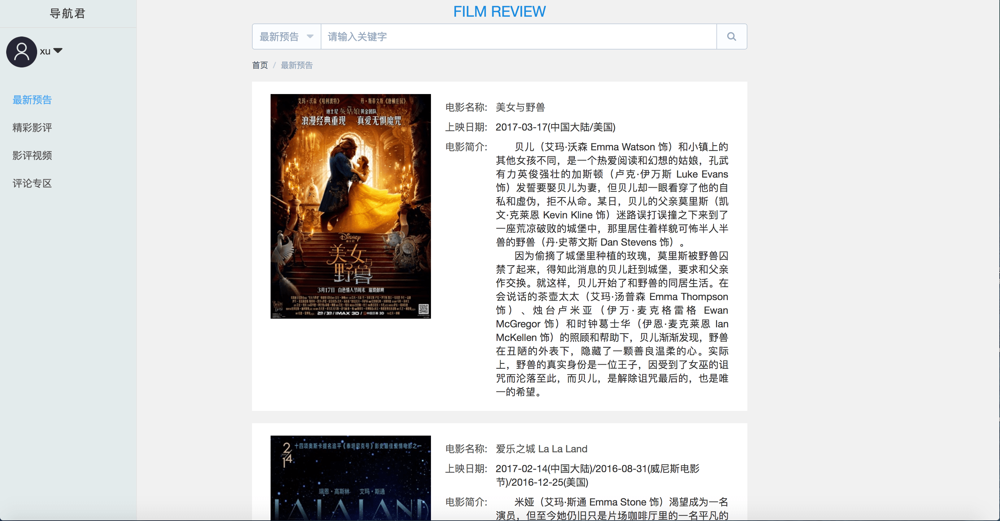

<h2>项目描述</h2>
	
使用vue2.0 + vue-router + vuex + element-ui实现的一个影评网站。网站设计没参考其他网站，完全是我自己意淫出来的。

  	
这就是一个纯前端的东西，由于没有后端，所以大多数功能都简化了。具体流程自行脑补。

<h2>项目运行</h2>
git clone https://github.com/xuyintao/filmReview.git 
cd filmReview 
npm install 
npm run dev 
<h2>项目预览</h2>
<a href="https://xuyintao.github.io/#/">预览</a>
<h2>部分截图</h2>

